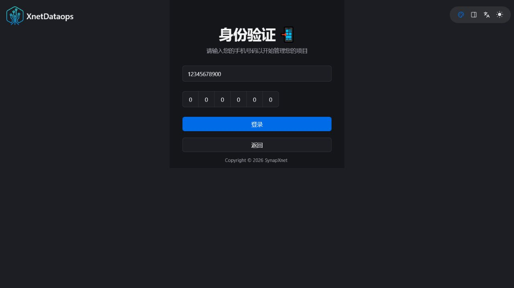
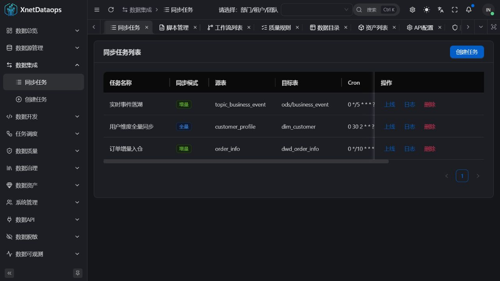
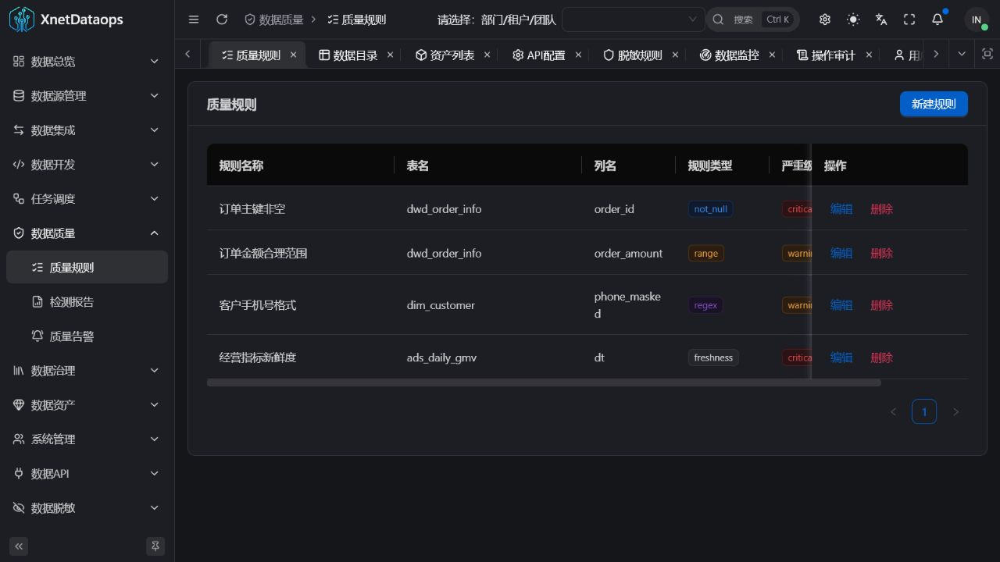
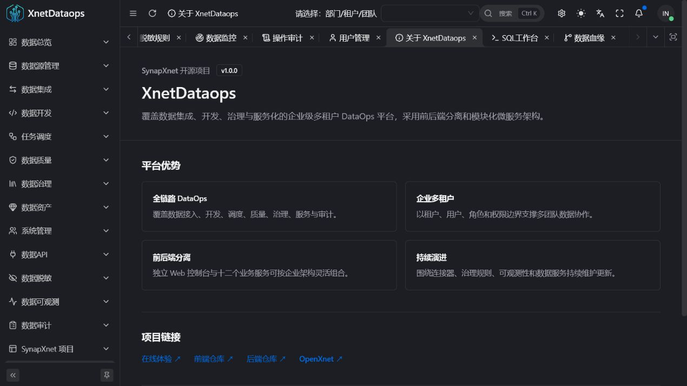

<div align="center">

[简体中文](./README.md) | [English](./README.en-US.md) | **日本語**

# XnetDataops

**データ統合、開発、ガバナンス、サービス化を支えるオープンソース DataOps**

[](https://www.xnetdataops.synapxnet.cn)
[](https://www.oracle.com/java/)
[](https://spring.io/projects/spring-boot)
[](./LICENSE)

[オンラインデモ](https://www.xnetdataops.synapxnet.cn) · [フロントエンド: XnetDataops-web](https://github.com/synapxnet/XnetDataops-web) · [OpenXnet](https://openxnet.synapxnet.com) · [ライセンス](./LICENSE)

</div>


## 画面プレビュー

| デモログイン | データソース設定 |
| --- | --- |
|  |  |
| データ統合 | SQL ワークベンチ |
|  |  |
| ワークフロー | データ品質 |
|  |  |
| データリネージ | データ API |
|  |  |
| データマスキング | 可観測性 |
|  |  |
| 監査 | プロジェクト情報 |
|  |  |

## 概要

XnetDataops は **SynapXnet チーム**が公開するエンドツーエンド DataOps プラットフォームです。データソース登録、加工、スケジューリング、品質、ガバナンス、API、可観測性、監査までを統合管理します。

本バックエンドと [XnetDataops-web](https://github.com/synapxnet/XnetDataops-web) は、企業向けマルチテナント、フロントエンド・バックエンド分離システムを構成します。12 個のサービスは一括またはモジュール単位で導入できます。

## GOAI Competition 1.0.0

`GOAI-Competition` ブランチは品質レポート、Schema スナップショット、安定した有界リネージュ、ワークフロー実行証拠を追加します。バージョン管理された Fixture は、本番特徴量 120 フィールドとモデル契約 128 次元の差を再現します。

[マイグレーション、Fixture、API 例、検証結果](./docs/goai-handoff/HANDOFF-GOAI-COMPETITION-1.0.0.md) · [対応するデータ証拠 UI](https://github.com/synapxnet/XnetDataops-web/tree/GOAI-Competition)

## 特長

- ユーザー、ロール、チーム、データ境界を備えた企業向けマルチテナント。
- 統合、開発、スケジューリング、品質、ガバナンス、提供までの一貫したフロー。
- フロントエンドとバックエンドを独立配備。
- コネクター、品質ルール、タスクノード、API、ポリシーを拡張可能。
- SynapXnet チームによる継続的な更新。

## モジュール

| モジュール | サービス | 主な機能 |
| --- | --- | --- |
| DSM | `dataops-dsm-service` | データソース接続とヘルスチェック |
| DIM | `dataops-dim-service` | 全量・増分同期、マッピング、ログ |
| DDV | `dataops-ddv-service` | SQL、スクリプト、保存クエリ、履歴 |
| TSK | `dataops-tsk-service` | DAG、依存関係、実行インスタンス |
| DQM | `dataops-dqm-service` | 品質ルール、レポート、アラート |
| DGV | `dataops-dgv-service` | メタデータ、カラム、リネージ、タグ |
| DAS | `dataops-das-service` | データ資産、分類、統計、アクセス履歴 |
| DAP | `dataops-dap-service` | データ API、キー、流量制御、呼出ログ |
| DMS | `dataops-dms-service` | マスキングルール、ポリシー、実行履歴 |
| DOB | `dataops-dob-service` | 鮮度、件数、スキーマ監視、SLA |
| DAU | `dataops-dau-service` | 監査、データ変更、コンプライアンス |
| USR | `dataops-usr-service` | 認証、ユーザー、ロール、アクセス制御 |

## クイックスタート

```bash
mvn -DskipTests package
cp .env.example .env
docker compose up -d --build
docker compose ps
```

JDK 17+、Maven 3.9+、Docker Compose、MySQL 8.x、Redis 7.x が必要です。

再実行可能な演示データは `sql/xnet_dataops_demo.sql` にあります。到達不能なデモ用アドレスと無効なプレースホルダーのみを使用し、ユーザー作成データを保持します。

## デモ

- URL: <https://www.xnetdataops.synapxnet.cn>
- 電話番号: `12345678900`
- 確認コード: `000000`

固定確認コードは公開デモ専用です。本番環境では安全な認証方式を使用してください。

## コミュニティとライセンス

XnetDataops は [OpenXnet](https://openxnet.synapxnet.com) の一部です。

[MIT License](./LICENSE) の下で公開されています。Copyright © 2026 SynapXnet.
