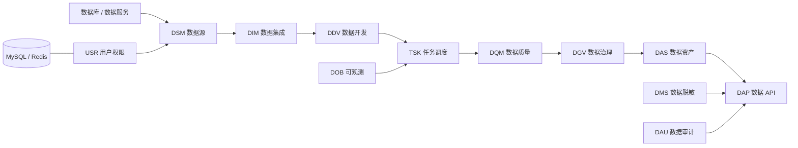

<div align="center">

# XnetDataops

**覆盖数据集成、开发、治理与服务化的开源 DataOps 平台**

[](https://www.xnetdataops.synapxnet.cn)
[](https://www.oracle.com/java/)
[](https://spring.io/projects/spring-boot)
[](./LICENSE)

[在线体验](https://www.xnetdataops.synapxnet.cn) · [前端仓库 XnetDataops-web](https://github.com/synapxnet/XnetDataops-web) · [OpenXnet 开源社区](https://openxnet.synapxnet.com) · [查看许可](./LICENSE)

</div>


## 项目简介

XnetDataops 是由 **SynapXnet 团队**开源的一站式 DataOps 平台，围绕数据从接入、加工、调度到治理、服务和审计的完整生命周期，提供统一的工程化管理能力。

本仓库是平台后端，与 [XnetDataops-web](https://github.com/synapxnet/XnetDataops-web) 前端仓库共同组成企业级、多租户、前后端分离系统。平台将不同数据职能拆分为十二个可独立部署的微服务，既可以整体运行，也可以按企业现有数据架构选择性接入。

## 项目优势

- **企业多租户**：以租户、用户、角色和权限边界支撑不同数据团队协作。
- **前后端分离**：控制台与服务接口独立迭代，便于接入企业门户和现有数据架构。
- **完整数据链路**：统一覆盖接入、开发、调度、质量、治理、服务与审计。
- **灵活模块化**：可扩展连接器、质量规则、调度节点、数据 API 与合规策略。
- **持续更新**：SynapXnet 团队会持续完善连接能力、治理规则、可观测性与文档。

## 核心能力

| 模块 | 服务目录 | 说明 |
| --- | --- | --- |
| DSM 数据源管理 | `dataops-dsm-service` | 统一维护数据库与数据服务连接，管理连接配置、连通性和数据源生命周期 |
| DIM 数据集成 | `dataops-dim-service` | 创建数据同步任务，配置字段映射，跟踪执行过程、同步结果与运行日志 |
| DDV 数据开发 | `dataops-ddv-service` | 提供 SQL 工作台、脚本管理、保存查询和查询历史，支撑日常数据开发 |
| TSK 任务调度 | `dataops-tsk-service` | 通过 DAG 设计工作流，管理节点依赖、执行计划、任务实例和运行状态 |
| DQM 数据质量 | `dataops-dqm-service` | 定义质量规则，生成质量报告并跟踪质量告警，构建持续的数据质量闭环 |
| DGV 数据治理 | `dataops-dgv-service` | 管理元数据目录、字段信息、数据血缘与标签，提升数据的可发现性和可理解性 |
| USR 系统管理 | `dataops-usr-service` | 提供登录认证、用户、角色和权限管理，支撑平台访问控制 |
| DAS 数据资产 | `dataops-das-service` | 建设数据资产目录，维护分类分级并汇总资产统计信息 |
| DAP 数据 API | `dataops-dap-service` | 将数据能力配置为 API，管理 API 密钥、调用记录与服务使用情况 |
| DMS 数据脱敏 | `dataops-dms-service` | 管理脱敏规则、脱敏策略和执行日志，降低敏感数据使用风险 |
| DOB 数据可观测 | `dataops-dob-service` | 配置数据监控项、记录监控事件与 SLA，持续观察数据管道健康度 |
| DAU 数据审计 | `dataops-dau-service` | 记录操作审计与数据变更，生成合规报告，为问题追溯提供依据 |

## 技术架构



后端使用 Java 17、Spring Boot 3.4.6、MyBatis、MySQL 与 Redis 构建，Maven 负责多模块依赖和统一构建，Docker Compose 可同时编排前端、十二个服务及基础数据库。

## 目录结构

```text
XnetDataops/
├── dataops-dsm-service/  # 数据源管理
├── dataops-dim-service/  # 数据集成
├── dataops-ddv-service/  # 数据开发
├── dataops-tsk-service/  # 任务调度
├── dataops-dqm-service/  # 数据质量
├── dataops-dgv-service/  # 数据治理
├── dataops-usr-service/  # 用户与权限
├── dataops-das-service/  # 数据资产
├── dataops-dap-service/  # 数据 API
├── dataops-dms-service/  # 数据脱敏
├── dataops-dob-service/  # 数据可观测
├── dataops-dau-service/  # 数据审计
├── deploy/               # 容器构建文件
├── XnetDataops.sql       # 数据库初始化脚本
└── docker-compose.yml    # 全栈容器编排
```

## 快速开始

### 环境要求

- JDK 17+
- Maven 3.9+
- Docker 与 Docker Compose

### Maven 构建

```bash
mvn -DskipTests package
```

### 全栈容器启动

`docker-compose.yml` 会构建同级的 `XnetDataops-web` 前端，并启动 MySQL、Redis 与全部后端服务。首次启动前必须配置 `MYSQL_ROOT_PASSWORD` 与 `JWT_SECRET`。

```bash
cp .env.example .env
docker compose up -d --build
docker compose ps
```

生产环境请将数据库、缓存和服务端口置于受控网络中，并使用独立密钥与强密码。

## 在线体验

- 访问地址：<https://www.xnetdataops.synapxnet.cn>
- 演示手机号：`12345678900`
- 演示验证码：`000000`

固定验证码仅用于开源项目展示，不应作为生产环境认证方案。

## SynapXnet 开源生态

XnetDataops 是 SynapXnet 开源体系的数据工程基础平台。更多项目与社区信息请访问 [OpenXnet](https://openxnet.synapxnet.com)。

## 参与贡献

欢迎提交 Issue 和 Pull Request。扩展服务时请保持模块职责单一，并为数据结构、接口和部署变量的变化提供迁移说明。

## 开源许可

本项目基于 [MIT License](./LICENSE) 开源。你可以自由使用、修改和分发本项目，但须保留原始版权与许可声明。
